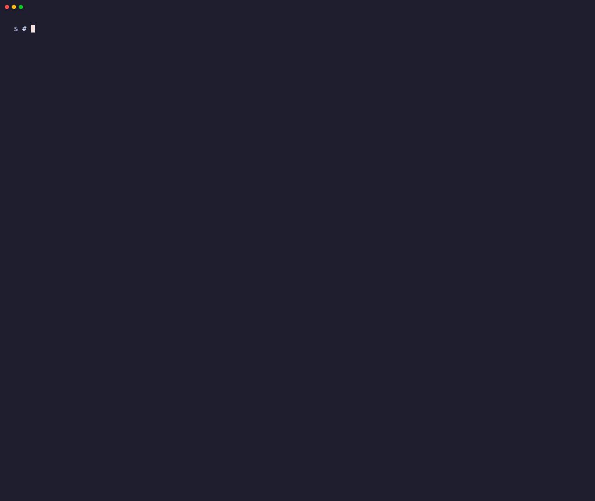
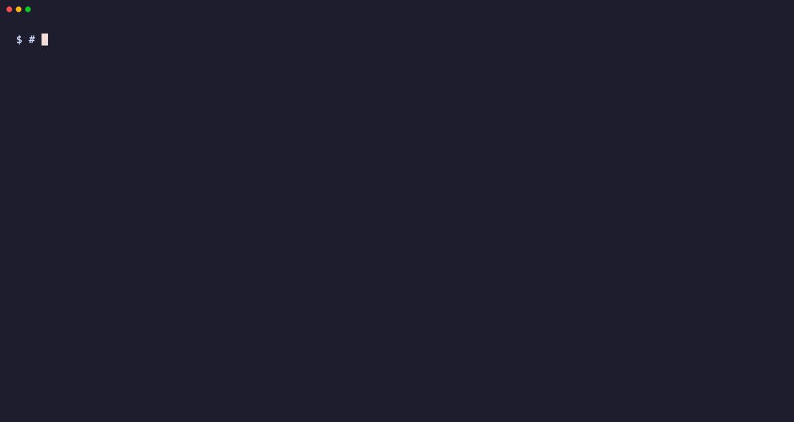

# Crystals

**Your coding agent keeps making the same mistake, even though you wrote the rule down.**
Crystals hands that rule to the agent at the moment it acts, so nobody has to remember to look it up.


**Install in 3 steps** (needs [Claude Code](https://claude.com/claude-code), Python 3 and a git repo; no service, no account, no network):

1. `git clone https://github.com/Tirthahq/crystal-memory ~/src/crystal-memory`
2. From inside **your** repo: `sh ~/src/crystal-memory/install.sh`
3. Paste the hook block it prints into `.claude/settings.json`.

The installer ends by firing a real crystal at you, so you see it work before you believe it.
Full walk-through: [INSTALL.md](INSTALL.md).

---

## What you just saw, step by step

```yaml
# memory/crystals/crystal-exit-code-through-a-pipe.md  (one of the three starters)
crystal:
  deliver: act
  on: bash
  match: | tail, |tail, | head, |head, | grep, |grep, ssh , ssm, <<'EOF', <<EOF
```

1. **A crystal is a markdown note with a binding.** `on: bash` names the action it belongs to.
   `match:` lists alternative keys that can match that action.
2. **The agent is about to run** `npm run build 2>&1 | tail -20`.
3. **Claude Code runs a hook as the command is issued.** The hook sees `| tail`, finds the note, and adds it to the agent's context.
4. **The note says why that is dangerous:** `tail` reports its own exit code, so a failed build reads as a pass.
5. **An unrelated command gets nothing.** The first line of the real output for `ls -la`:

```
[dry] act=bash would fire 0:
```

The agent did not ask. It did not know the note existed. That is the whole idea.

**What the timing means today, stated plainly.** The hook fires before the command runs, but by then the agent has already chosen the command, and it reads the note together with the command's result. So in this release a crystal shapes the agent's next step, not the step it is on. We have watched our own agent read a warning about the exact command it had just run. A mode that refuses the command once and hands back the note, so the agent sees it before anything executes, is in testing and is not in this release.

---

## Why not a rules file, or a search index?

```
  RULES FILE (CLAUDE.md)      SEARCH INDEX (RAG, wiki)       CRYSTAL
  ----------------------      ------------------------       -------
  always loaded               only if someone searches       only when the act matches
  one line in a long file     you must suspect the answer    arrives with the act
  becomes background noise    to write the query             silent the rest of the time
```

You cannot look up the mistake you do not know you are about to make: forming the query means already suspecting the answer.
A crystal skips the looking. It is quiet almost all the time, and speaks at the moment the note is about.

**The cost is real:** a human writes every note, one at a time.
We tried generating them from a codebase and it invented a statistic that appeared nowhere in the source.

More: [docs/how-it-works.md](docs/how-it-works.md).

---

## Before and after

```
  WITHOUT                                       WITH
  -------                                       ----
  agent: npm run build 2>&1 | tail -20          agent: npm run build 2>&1 | tail -20
         exit code 0 (tail's, not the build's)  hook:  delivers the pipe crystal first
  agent: "build is green"                       agent: runs it clean, reads the real exit code
  (the rule was in a file nobody opened)        (the rule arrived at the act it was written for)
```

---

## Installing, as it looks



The end of a real install, into an empty project:

```
  12 copied, 0 replaced, 0 already current, 0 differ and were left alone, 3 crystal(s) seeded

  registry loads : 9 crystal(s)
  loop fires     : yes
                   [dry] act=bash would fire 2:
                       crystal-exit-code-through-a-pipe.md
                       crystal-green-tests-do-not-prove-head-builds.md
```

1. It creates `scripts/`, `memory/` and `scratch/` in your repo, and touches nothing outside it.
2. It seeds three starter crystals into `memory/crystals/`.
3. It **prints** the hooks instead of editing your settings. Until you paste them, the loop is installed and silent.
4. Run it twice and it overwrites nothing. `--upgrade` replaces package scripts after a backup. `--selftest` proves all of that on a throwaway repo.

---

## It also guards the start of every session



A note written two days ago, never committed, never mentioned. At boot, `crystal_uncommitted.py` says so:

```
📌 UNCOMMITTED (1 files): a decision only where the handoff or scratchpad NAMES it.
  ⚠ POSSIBLY LOST WORK: 1 hand-written file(s) older than 12h, named nowhere. Commit each, or name it in the handoff with the reason it waits:
     · notes/retry-plan.md  (48h)
  held (named): 0 · generated: 0 · recent (<12h, in progress): 0   full list: git status
```

When the context is compacted, `crystal_midflight.py` saves what a summary loses, and hands it back at the next start (excerpt):

```
━━ MID-FLIGHT (written by the PreCompact hook 0.0 h ago) ━━
## Your most recent messages (verbatim, oldest first; mid-turn ones included)
- [2026-09-26 14:02] Add retries to the upload job.
- [2026-09-26 14:20] Keep the old endpoint working until Friday, the mobile app still calls it.
- [2026-09-26 14:31] Wait, do not delete the v1 route, just mark it deprecated.
```

The last line is the kind a summary tends to drop: a correction typed while the agent was working.

What each boot hook does:

| hook | what arrives at session start |
|---|---|
| `crystal_scratchpad.py --boot` | the scratchpad: what you were in the middle of, the hunch not yet proven, the thing left undone and why |
| `crystal_handoff.py --boot` | the last handoff's next action (silent until one is written) |
| `crystal_midflight.py --boot` | what the PreCompact capture saved: your latest words verbatim, jobs in flight, open loops |
| `crystal_uncommitted.py --boot` | old, hand-written files nothing names: possibly lost work (silent when nothing is at risk) |

**A crystal arrives before the mistake. The scratchpad carries your reasoning across a context reset.**
Neither one waits to be searched. Longer version: [docs/how-it-works.md](docs/how-it-works.md#the-capture-reminder-and-the-scratchpad).

---

## Try it without installing anything

```
$ python3 scripts/crystal_starter.py selftest
  [PASS] empty foreign store: doctor exits 2 (nothing to deliver)
  [PASS] unseeded store is silent for an unrelated command
  [PASS] seeded 3 starter crystals (got 3)
  ...
  [PASS] fires on `npm run build 2>&1 | tail -20`
  [PASS] fires on `git commit -m fix`
  [PASS] re-seed does not overwrite a file the tester edited
  [PASS] sabotage control: a starter crystal stripped of its essence marker turns doctor red
SELFTEST: starter set on a clean foreign repo PASS
```

Run that from a clone. It builds a throwaway repo in a temp directory and proves the whole loop in fifteen checks.
Nothing is written outside the temp directory.

---

## Write your own

```yaml
---
name: crystal-my-first-one
crystal:
  deliver: act        # push it, do not wait to be asked
  on: bash            # bash, write, commit, prompt or boot
  match: terraform apply, kubectl delete
  who: all
---

<!-- crystal:essence -->
The text between these markers is the only part that is ever delivered. Keep it short.
<!-- /crystal:essence -->
```

1. Save it under `memory/crystals/`.
2. Watch it fire: `python3 scripts/crystal_act.py --act bash --ctx "kubectl delete pod web-1" --text`
3. Leave the `match:` list unquoted. Quote marks become part of the words, and then nothing matches.
4. `--dry` with no `--ctx` fires nothing on purpose: with no text to match, nothing can match. It says so.

A note that states live facts can carry a shelf life (`stale_after`) and a check command (`discriminator`).
A note about one server can name it (`depends_on`). Both are in [docs/how-it-works.md](docs/how-it-works.md#a-note-that-asserts-live-state-needs-a-shelf-life).
Troubleshooting and the full format: [INSTALL.md](INSTALL.md#write-your-own).

---

## The catalogue: useful with nothing installed

```
| What you would say                                    | Family | Entry                                   |
| all the checks are green and the screen is blank      | A      | a-component-that-needs-starting-...     |
| the PR page says passing and the job log says failed  | C      | an-instrument-that-answers-a-...        |
| it works on my machine but CI is red                  | E      | an-instrument-that-reshapes-input-...   |
```

[`catalogue/`](catalogue/README.md) is twenty-one real verification failures from running this on our own repo:
a check passed while the thing it checked was broken, or a measurement was true about the wrong population.

- Every entry carries the rival explanation and the discriminator that separated them.
- It opens on an **arrival index**, keyed to what you would say before you know the cause.
- Twelve of the twenty-one still have no arrival sentence, and the page says so.
- ⚠ The index page is generated in our tree and the generator is not shipped. The entries are plain markdown and stand without it.

---

## What is in the box

| | |
|---|---|
| `scripts/` (the loop) | `crystal_act.py`, `crystal_registry.py`, `crystallize-stop-hook.py`, `crystal_inject.py`, `crystal_starter.py`, `crystal_scratchpad.py`, `crystal_handoff.py`, `crystal_growth.py`, `crystal_midflight.py`, `crystal_uncommitted.py`, `crystal-discriminators.py` |
| `starter/` | three portable crystals, seeded into your repo as `memory/crystals/*.md` |
| `catalogue/` | twenty-one verification failures, readable with nothing installed |
| the maintenance layer, optional | four agents that tend the store rather than use it: [docs/maintenance.md](docs/maintenance.md) |
| `docs/demo/` | the tapes and fixture that recorded the GIFs on this page |

**It speaks, and it never blocks.** The delivery path is standard-library Python, launches no processes, and writes only inside your repo.
Two parts do launch processes, and [docs/how-it-works.md](docs/how-it-works.md#what-runs-and-what-launches-processes) names them.
Nothing in the package reaches the network.

---

## What we have measured, and what we have not

```
  measured on:   one repo, one team, one corpus
  holdout:       three model families; one scenario separated cleanly on all three
  the others:    did not replicate, because that model already knew the thing
```

- A crystal cannot help where the model is not going to make the mistake.
- Selection is literal matching. Too broad fires on everything; too narrow never fires. There is no tuning loop yet.
- The freshness check detects drift. It cannot tell you whether the note is now wrong.

The numbers, the caveats and the three write-ups: [docs/measured.md](docs/measured.md).

---

## If you are testing this for us

1. **Most useful:** the moment you thought *"I installed it and nothing happened."* Tell us which screen you were looking at.
2. A crystal of yours that fired when it should not have.
3. One that should have fired and did not.

---

## How the GIFs on this page were made

```
$ sh docs/demo/record.sh          (excerpt)
privacy checks
  [ok] CANARY-REAL-HOME-7731 ABSENT from every published take
  [ok] CANARY-REAL-TMP-7731 ABSENT from every published take
  [ok] control arm (overrides off): CANARY-REAL-HOME-7731 APPEARS on 14 line(s), so its absence check can fire
  [ok] control arm (overrides off): CANARY-REAL-TMP-7731 APPEARS on 2 line(s), so its absence check can fire
  [ok] and the private-string check fires on the control take: 10 line(s)
  [ok] zero private-string hits in the published takes
RECORD PASS
```

1. Each tape runs in a throwaway fixture: a fresh `HOME`, a copy of this repo, a neutral git identity, an empty environment.
2. A marker string is planted in the real places the fixture replaces. The published takes must not contain it.
3. One take is re-recorded with the fixture switched off, and the marker must appear. That proves the check can fire.

Tapes and scripts: [docs/demo/](docs/demo/). Needs [vhs](https://github.com/charmbracelet/vhs).

---

## Where this came from

Built and run by [Spanda Works](https://github.com/tjonesit), a one-person shop, inside a working product repo.
It exists because we kept making the same three or four classes of mistake, and wanted something that interrupted the fourth time rather than the fortieth.

## License

Apache License 2.0: the full text is in `LICENSE`, and the attribution notice is in `NOTICE`.
Use it, change it, redistribute it, including commercially, as long as you keep the notice and state your changes.

- **It grants you a patent licence, explicitly.** That grant ends only if you sue somebody over patents in it.
- **It does not grant trademark rights.** Spanda Works, Tirtha and Ra stay ours. Build on the code, fork it, ship it. Just do not call yours by our names.

The three crystals under `starter/` are documentation rather than code. They record things we observed while building our own systems, and carry the same licence.

## Match semantics and delivery order

Matching uses a comma-separated OR-list, case-insensitively. Keys normally match substrings,
including longer tool names and path prefixes. Keys shorter than five characters, plus
`guard`, `copy`, `usage`, `board`, `bench`, `reply`, and `price`, require word boundaries
(no adjacent letters, digits, or underscore): `guard` matches “run guard” but not “guardrails”.
A missing or empty list admits every context that reaches matching; dependency and act bindings
still apply. Long writes match their subject and target path rather than their whole body.

Delivery orders eligible notes by how often they have spoken in the current session first.
Within each rotation tier, the default ranks word overlap with the act ahead of last-delivery
time, payload length, and filename. Overlap is Jaccard similarity of lowercase word tokens
at least three characters long, using the first 1,500 essence characters. `CRYSTAL_ORDER=rotation`
restores the previous ordering. Backoff, session caps, and the character budget still apply;
overlap ranks already-matched candidates and does not admit new ones. Adaptive packing is not
included in this release.
